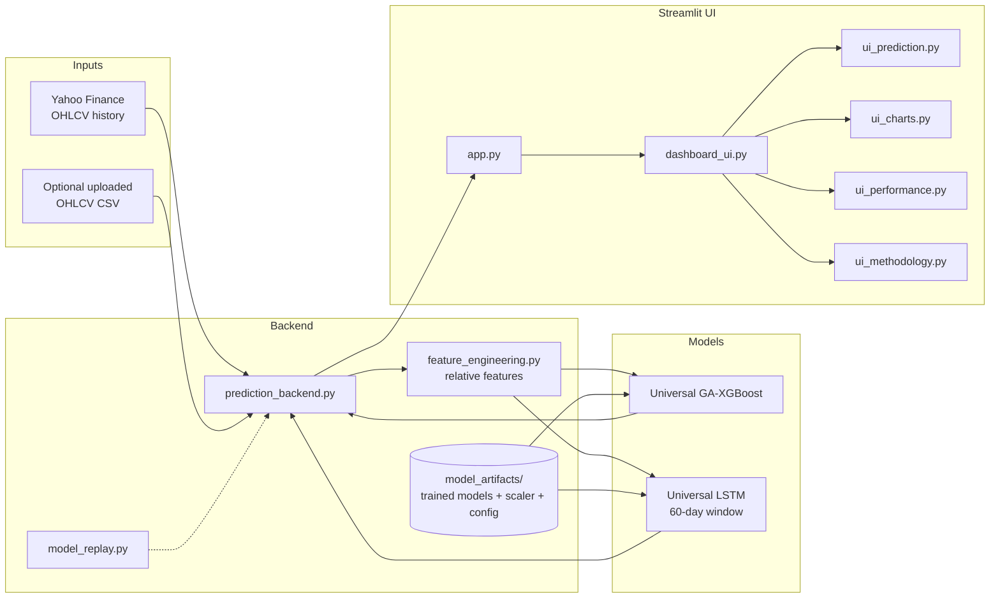

<div align="center">

# 📈 NSE Stock Direction Prediction

### Universal GA-XGBoost + LSTM classifiers for next-day UP / DOWN prediction of NSE stocks


[Overview](#-project-overview) •
[Features](#-key-features) •
[Architecture](#-system-architecture) •
[Model](#-model-details) •
[Run locally](#-running-the-application-locally-windows) •
[Performance](#-model-performance) •
[Limitations](#-limitations) •
[Author](#-author)

</div>

---

## 📌 Project Overview

This project is a **Streamlit application** that predicts the **next-day closing direction** (**UP** or **DOWN**) of NSE-listed stocks using two *universal* classifiers trained across many stocks:

* a **Universal GA-XGBoost classifier** — XGBoost trained on a feature subset chosen by a **Genetic Algorithm**
* a **Universal LSTM classifier** — a TensorFlow/Keras network that reads a **60-trading-day** window

Both models output **P(UP)**, the estimated probability of the UP class. The app shows each model's P(UP), a **model consensus**, historical price charts, technical indicators, recorded model performance, and methodology notes.

> [!IMPORTANT]
> The application predicts **direction only** (UP / DOWN). It does **not** predict an exact future price or a percentage move.

---

## 🎯 Why This Project

* **One model, many stocks.** Instead of training a separate model per company, one universal model learns common technical patterns from a multi-stock training universe. Features are engineered in a *relative* (scale-free) form, so stocks with very different price levels can share the same model.
* **Two complementary approaches.** A tree-based classifier on engineered indicators and a sequence model on 60-day windows are shown side by side, so you can see where they agree and disagree.
* **Honest framing.** Next-day direction is a hard, noisy problem. The app reports probabilities and recorded evaluation results, and documents its limitations instead of promising returns.

---

## ✨ Key Features

| Area | What the application provides |
|---|---|
| 🔎 **Stock selection** | Choose a stock to analyse |
| 🌐 **Data source: Yahoo Finance** | Fetch OHLCV market history for inference |
| 📄 **Data source: CSV upload** | Optionally upload your own **OHLCV** CSV |
| 🔮 **Next-day prediction** | UP / DOWN direction for the next trading day |
| 🌲 **XGBoost P(UP)** | Probability from the Universal GA-XGBoost model |
| 🧠 **LSTM P(UP)** | Probability from the Universal LSTM model (60-trading-day sequence) |
| 🤝 **Model consensus** | Shows whether the two models agree |
| 📊 **Historical price charts** | Interactive price history |
| 🧮 **Technical indicators** | Indicator views derived from the price history |
| 🏁 **Model performance** | Recorded evaluation results of the trained models |
| 📚 **Methodology / architecture** | In-app explanation of how the models were built |

---

## 🧬 AI / Model Architecture

```text
                    ┌──────────────────────────────────────────────┐
                    │          84 engineered features              │
                    │ (relative technical / price-volume features) │
                    └──────────────────────┬───────────────────────┘
                                           │
                         Genetic Algorithm feature selection
                                           │
                                  43 selected features
                    ┌──────────────────────┴───────────────────────┐
                    │                                              │
          ┌─────────▼──────────┐                      ┌────────────▼────────────┐
          │ Universal          │                      │ Universal LSTM          │
          │ GA-XGBoost         │                      │ (60-trading-day window) │
          │ (latest row)       │                      │ TensorFlow / Keras      │
          └─────────┬──────────┘                      └────────────┬────────────┘
                    │ P(UP)                                        │ P(UP)
                    └──────────────────────┬───────────────────────┘
                                           ▼
                              UP / DOWN + model consensus
```

* **Training universe:** 100 stocks
* **Feature engineering:** 84 features → **43** kept after Genetic Algorithm selection
* **LSTM input:** 60 trading days per sample

---

## 🏗️ System Architecture



> The diagram shows the modules listed in this repository's structure. See [Project Structure](#-project-structure) for what each file is responsible for.

---

## 🔄 Prediction Workflow

```mermaid
flowchart TD
    A[Market history\nfor the selected stock] --> B[Data normalization]
    B --> C[Feature engineering\n84 features]
    C --> D[GA-selected features\n43 features]
    D --> E[XGBoost]
    D --> F[LSTM\n60-trading-day sequence]
    E --> G[P&#40;UP&#41; from XGBoost]
    F --> H[P&#40;UP&#41; from LSTM]
    G --> I{UP / DOWN\nper model}
    H --> I
    I --> J[Model consensus]
```



```text
Market history
      ↓
Data normalization
      ↓
Feature engineering
      ↓
GA-selected features
      ↓
XGBoost + LSTM
      ↓
P(UP)
      ↓
UP / DOWN
```

### How to read the output

| Term | Meaning |
|---|---|
| **UP** | The model predicts that the **next-day closing direction is upward**. |
| **DOWN** | The model predicts that the **next-day closing direction is downward**. |
| **P(UP)** | The model's estimated probability for the **UP class**. |
| **Model consensus** | Whether the XGBoost and LSTM predictions agree. |

> [!NOTE]
> **P(UP) is a class probability.** It does **not** mean the stock price will increase by that percentage. A P(UP) of 0.62 means the model assigns 62 % probability to the UP class — not a 62 % price gain.

---

## 🤖 Model Details

### Universal GA-XGBoost classifier
* Gradient-boosted trees (**XGBoost**, binary classification) trained on the **43 features** chosen by the Genetic Algorithm.
* Predicts from the engineered features of the most recent trading day.

### Genetic Algorithm feature selection
* Each candidate solution is a binary chromosome over the 84 engineered features (1 = feature used, 0 = not used).
* The search keeps the feature subset that performs best, reducing 84 features to **43**.

### Universal LSTM classifier
* **TensorFlow / Keras** sequence model.
* Input: a **60-trading-day** window of the selected features, standardized with the saved scaler.
* Output: P(UP) for the next trading day.

### "Universal" means
* The same trained models are used for every supported stock.
* They were trained on a **100-stock training universe**, not on a single company.

---

## 🧪 Feature Engineering

Features are computed **independently for each stock** from OHLCV data and are expressed in **relative / scale-free form** (for example, price distance from a moving average rather than raw price) so one model can serve stocks with very different price levels.

* **84 engineered features** in total, **43 selected** by the Genetic Algorithm
* Technical / relative features derived from OHLCV (price returns, moving-average based, momentum, volatility and volume features)
* The feature code lives in [`feature_engineering.py`](feature_engineering.py) and the exact feature order is stored in [`model_artifacts/universal_features.json`](model_artifacts/universal_features.json)

---

## 🗂️ Dataset Description

Three different kinds of data are involved — they are **not** the same thing:

| Purpose | Data | Notes |
|---|---|---|
| **Training data** | Historical **NSE** stock data for a **100-stock universe** | Ends on **2023-12-29**. Used once to train the models. |
| **Inference data** | **Yahoo Finance** history fetched when you use the app, or an **uploaded OHLCV CSV** | Used only to compute features and produce a prediction. It does **not** retrain anything. |
| **Saved evaluation results** | Result files stored in the repository | Recorded when the models were evaluated; see [Model Performance](#-model-performance). |

A custom CSV needs **Open, High, Low, Close, Volume** columns with dates.

---

## 📁 Project Structure

```text
Stock-prediction-using-LSTM/
├── app.py                          # Streamlit entry point
├── prediction_backend.py           # Prediction pipeline used by the app
├── feature_engineering.py          # Feature computation
├── model_replay.py                 # Model replay / evaluation support
├── dashboard_ui.py                 # Dashboard layout
├── ui_prediction.py                # Prediction tab
├── ui_charts.py                    # Historical price charts / technical indicators
├── ui_performance.py               # Model performance tab
├── ui_methodology.py               # Methodology / architecture tab
├── model_artifacts/                # Trained models and preprocessing files
├── latest_predictions_all_stocks.csv
├── requirements.txt
├── run_app.bat                     # Windows launcher
└── README.md
```

### `model_artifacts/`

| File | Purpose |
|---|---|
| `universal_ga_xgboost.json` | The trained Universal GA-XGBoost model |
| `universal_lstm.keras` | The trained Universal LSTM model |
| `universal_lstm_scaler.pkl` | Scaler fitted on the training data, applied to LSTM inputs |
| `universal_features.json` | Exact feature order (all features, GA-selected features, LSTM features) |
| `universal_config.json` | Model configuration (window length, thresholds, parameters) |
| `supported_stocks.json` | List of supported stocks |

---

## 🧰 Requirements

* **Windows 10/11** (instructions below; Streamlit itself is cross-platform)
* **Python 3** and `pip`
* **Git**
* Internet connection when using the Yahoo Finance data source
* Python packages listed in [`requirements.txt`](requirements.txt) (including Streamlit, TensorFlow/Keras and XGBoost)

---

## ⚙️ Installation

```bat
git clone https://github.com/varuns1602-D/Stock-prediction-using-LSTM.git
cd Stock-prediction-using-LSTM
```

## 🐍 Virtual Environment Setup

**Create** the virtual environment:

```bat
python -m venv venv
```

**Activate** it (Command Prompt):

```bat
venv\Scripts\activate
```

<details>
<summary>Using PowerShell instead?</summary>

```powershell
venv\Scripts\Activate.ps1
```

If PowerShell blocks the script, run this once in the same window and try again:

```powershell
Set-ExecutionPolicy -Scope Process -ExecutionPolicy Bypass
```
</details>

**Install** the requirements:

```bat
pip install -r requirements.txt
```

---

## ▶️ Running the Application Locally (Windows)

With the virtual environment activated:

```bat
streamlit run app.py
```

### 🌐 Exact localhost URL

```text
http://localhost:8501
```

Streamlit normally opens this page in your browser automatically. If it does not, paste the URL above into your browser.

### ⏹️ Stopping the application

Click the terminal window running Streamlit and press **`Ctrl + C`**.

### Alternative: `run_app.bat`

The repository includes **`run_app.bat`**, a Windows launcher. You can double-click it, or run it from the project folder:

```bat
run_app.bat
```

---

## 🧭 Step-by-Step Usage

1. Start the app and open `http://localhost:8501`.
2. **Select a stock** from the supported stocks.
3. Choose the **data source**: **Yahoo Finance**, or **upload an OHLCV CSV**.
4. Open the **prediction** view to see the next-day **UP / DOWN** result, the **XGBoost P(UP)**, the **LSTM P(UP)**, and the **model consensus**.
5. Open the **charts** view for historical prices and technical indicators.
6. Open the **model performance** view for the recorded evaluation results.
7. Open the **methodology** view for the architecture and training details.

---

## 🔍 Example Prediction Interpretation

| Output | Example | How to read it |
|---|---|---|
| XGBoost P(UP) | `0.58` | XGBoost assigns 58 % probability to the UP class |
| LSTM P(UP) | `0.44` | LSTM assigns 44 % probability to UP (56 % to DOWN) |
| Model consensus | Models disagree | One model leans UP, the other DOWN — treat this as low agreement |

* A probability near **0.50** means the model has little preference either way.
* The numbers above are **illustrative only** and are not real predictions.
* P(UP) is **not** an expected percentage price increase.

---

## 🏆 Model Performance

> [!WARNING]
> **Fill this table from the repository's saved result files before publishing.** The values must be copied exactly as recorded — they are intentionally left blank here so that no number is invented.

| Model | Accuracy | Precision | Recall | F1 | ROC-AUC |
|------|------:|------:|------:|------:|------:|
| Universal GA-XGBoost | _from results file_ | _from results file_ | _from results file_ | _from results file_ | _from results file_ |
| Universal LSTM | _from results file_ | _from results file_ | _from results file_ | _from results file_ | _from results file_ |

**Source of the headline numbers:** _name the result file here (for example the results CSV in `model_artifacts/`)_.

Notes on interpreting the results:

* The metrics are **recorded evaluation results from training time**. They are not recalculated by the app and are not a live track record.
* They describe performance on the data the models were evaluated on, which ends no later than **2023-12-29**.
* Next-day direction is hard to predict; compare any accuracy figure with a simple baseline (for example always predicting the more common class) before drawing conclusions.

---

## 🖼️ Screenshots / Results

<!-- Add only images that exist in the repository, for example:

-->

_Add application screenshots and result figures here. Reference only image files that actually exist in the repository._

---

## 🔬 Methodology

1. **Data preparation** — historical NSE OHLCV data for a 100-stock universe, ending on 2023-12-29.
2. **Feature engineering** — 84 relative technical features, computed separately within each stock so no information crosses between companies.
3. **Target** — next-day closing direction (UP / DOWN).
4. **Feature selection** — a Genetic Algorithm selects 43 of the 84 features.
5. **Model training** — a universal XGBoost classifier on the selected features, and a universal LSTM on 60-trading-day windows.
6. **Evaluation** — Accuracy, Precision, Recall, F1 and ROC-AUC, stored as recorded results.
7. **Deployment** — trained artifacts are loaded by the Streamlit app, which computes the same features on fresh inference data.

The methodology is an adaptation of the idea of combining Genetic Algorithm feature selection with XGBoost; it is not a reproduction of any published experiment.

---

## ⚠️ Limitations

* **Direction only.** The models predict UP / DOWN, not prices or magnitudes.
* **Training cut-off.** The models were trained on historical data ending **2023-12-29**. Fetching newer data from Yahoo Finance supplies fresh *inputs*; it does **not** retrain the models on newer market conditions.
* **Market regime drift.** Patterns learned from past data may not hold in future conditions.
* **Noisy target.** Next-day direction is close to random for liquid stocks; small differences from chance should not be over-interpreted.
* **Technical features only.** News, fundamentals, macro events and order-book information are not used.
* **Data-source dependence.** Inference quality depends on the availability and correctness of Yahoo Finance data or the uploaded CSV.
* **Not a trading system.** The app does not place trades and is not a real-time trading tool.

---

## 📜 Disclaimer

> This project is for **educational and research purposes only**. It is **not financial advice**, and it does not guarantee any prediction or outcome. Do not use it to make investment or trading decisions. Trading and investing involve risk, including loss of capital.

---

## 👤 Author

**Varun S**
Computer Science & Engineering

GitHub: [https://github.com/varuns1602-D](https://github.com/varuns1602-D)

---

## 🚀 Future Improvements

* Periodic **retraining** on newer data so the models reflect recent market conditions
* Evaluation on a rolling / walk-forward basis with a published history of results
* Additional model families and ensembling strategies for comparison
* Optional use of market-wide (index) features
* Probability **calibration** and clearer confidence reporting
* Automated tests and continuous integration for the pipeline
* Exportable prediction reports

---

<div align="center">

⭐ If you find this project useful, consider starring the repository.

</div>
